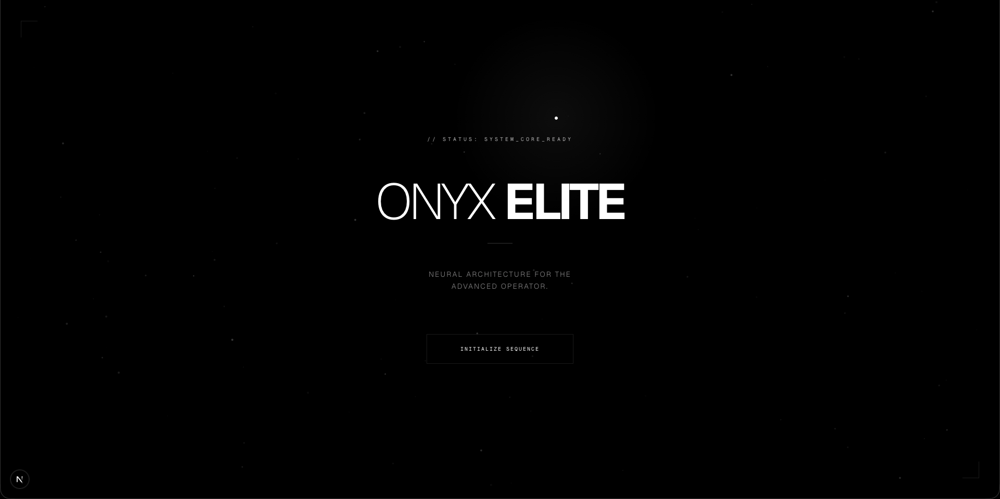
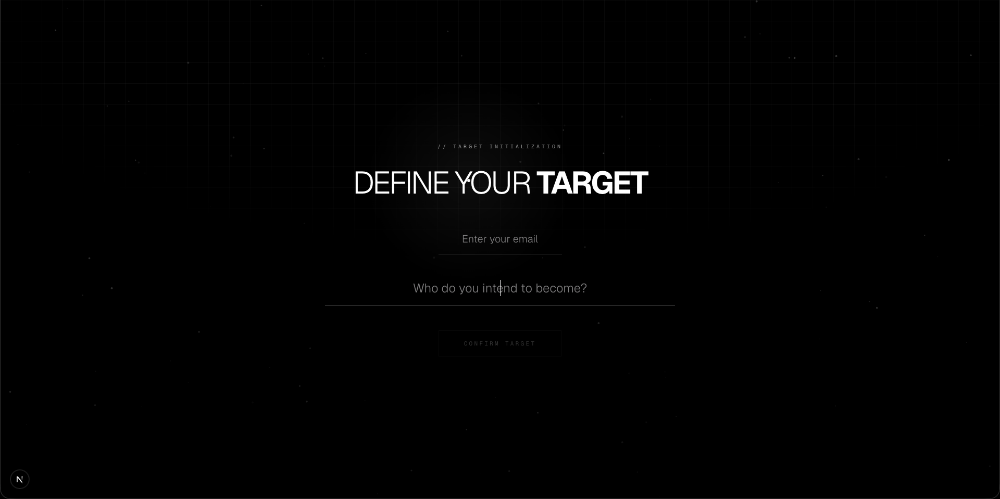

# Ashborn System

Ashborn is an AI‑driven personal evolution system inspired by game‑style progression. Users define a life goal, undergo an AI evaluation, and receive a rank based on discipline and alignment with their goal.

The system evaluates intent, commitment, and current capability through structured questions and assigns a starting level similar to a "player rank".

---

# Core Concept

Users enter the system with a goal.

Example goals:

- Become an AI engineer
- Become the strongest athlete
- Build a billion‑dollar company

The system then:

1. Generates evaluation questions
2. Collects answers
3. Uses AI to analyze responses
4. Assigns a rank and scores

Ranks:

```
E → D → C → B → A → S
```

Scores:

- Discipline Score
- Alignment Score

These scores represent how serious and aligned the user is with their declared goal.

---

# System Flow

```
User enters email + goal
        ↓
User created in backend
        ↓
AI generates evaluation questions
        ↓
User answers onboarding questions
        ↓
AI evaluates answers
        ↓
Rank + scores assigned
        ↓
User enters dashboard
```

---

# Tech Stack
Built using an AI-assisted development workflow with Claude Code and Cursor.

## 📸 Screenshots

### Home Page


### Dashboard


## Frontend

- Next.js (App Router)
- TypeScript
- Framer Motion
- Tailwind CSS

## Backend

- FastAPI
- PostgreSQL
- SQLAlchemy
- OpenAI API

---

# Database Schema

## users

```
id
email
created_at
```

## user_identity

```
id
user_id
goal
rank
discipline_score
alignment_score
onboarding_completed
created_at
```

---

# Backend APIs

## Initialize User

```
POST /auth/init
```

Creates or retrieves a user and stores their goal.

---

## Get User

```
GET /auth/users/{id}
```

Returns user identity including rank and onboarding status.

---

## Generate Evaluation Questions

```
GET /ai/evaluation-questions
```

Returns:

- Static psychological questions
- Dynamic AI‑generated goal‑specific questions

---

## Submit Evaluation

```
POST /ai/submit-evaluation
```

Sends answers to the AI judge and updates the user identity with:

- rank
- discipline_score
- alignment_score
- onboarding_completed

---

# Frontend Flow

The onboarding flow follows this sequence:

```
INITIALIZE
PROCESSING_1
EVALUATION
PROCESSING_2
COMPLETE
```

### INITIALIZE
User enters email and goal.

### PROCESSING_1
System generates evaluation questions.

### EVALUATION
User answers questions.

### PROCESSING_2
AI evaluates responses.

### COMPLETE
User rank is determined and the user is redirected to the dashboard.

---

# Project Structure

```
app/
  onboarding/
  dashboard/

backend/
  routes/
  models/
  services/

core/
  static_questions
```

---

# Running the Project

## Frontend

```
npm install
npm run dev
```

Open:

```
http://localhost:3000
```

---

## Backend

Run FastAPI server:

```
uvicorn run:app --reload
```

Server:

```
http://127.0.0.1:8000
```

API Docs:

```
http://127.0.0.1:8000/docs
```

---

# Future Features

Planned system expansions:

- Player dashboard
- Daily mission system
- Progress tracking
- Rank evolution
- AI mission generator

---

# Vision

Ashborn is designed as a structured AI system that treats personal growth like a progression game.

Instead of vague productivity tools, the system evaluates commitment and creates a progression path toward the user's declared goal.
